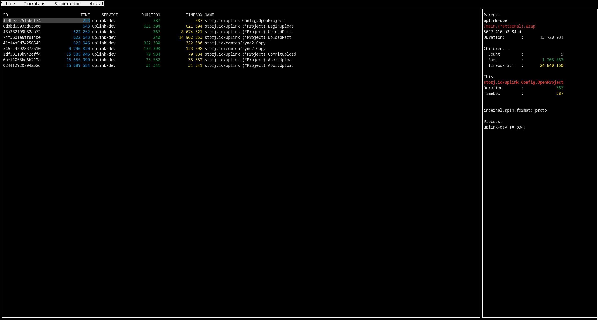

`traceview` is a simple application to display distributed tracing information downloaded from Jaeger.

It can display spans in tree hierarchy. Can be useful for traces with thousands of spans.


# Features 

## Interactive view

Open an interactive view:

```
traceview examples/209df7112fade79a.json
```



Navigation: use keys 1/2/3/4... between navigating the tabs. Use `/` for filtering (for example on tab 4)

Units are in nanoseconds (`504 123` is roughly half second)


## Grepping one or multiple span json

Grep for a pattern in one file or a directory of json files. 

```
traceview grep examples BeginObject

209df7112fade79a.json storj.io/uplink/private/metaclient.(*Client).BeginObject 553296
209df7112fade79a.json storj.io/common/rpc/rpctracing./metainfo.Metainfo/BeginObject 535068
209df7112fade79a.json storj.io/storj/satellite/metainfo.(*Endpoint).BeginObject 534824
209df7112fade79a.json storj.io/storj/satellite/metabase.(*DB).BeginObjectExactVersion 18363
3f4b1c811b74e07e.json storj.io/uplink/private/metaclient.(*Client).BeginObject 167028
3f4b1c811b74e07e.json storj.io/common/rpc/rpctracing./metainfo.Metainfo/BeginObject 143466
3f4b1c811b74e07e.json storj.io/storj/satellite/metainfo.(*Endpoint).BeginObject 143296
3f4b1c811b74e07e.json storj.io/storj/satellite/metabase.(*DB).BeginObjectExactVersion 10845
5bcf7841f756cf22.json storj.io/uplink/private/metaclient.(*Client).BeginObject 146262
5bcf7841f756cf22.json storj.io/common/rpc/rpctracing./metainfo.Metainfo/BeginObject 122103
5bcf7841f756cf22.json storj.io/storj/satellite/metainfo.(*Endpoint).BeginObject 121994
5bcf7841f756cf22.json storj.io/storj/satellite/metabase.(*DB).BeginObjectExactVersion 10390
```

## Grep for multiple entries

This is very similar to a grep, but you can define multiple entries in an external file.

Filter file may contain a specifal `@root` matcher which prints out the root span.

Example filter file:

```
@root
BeginObject
```

Example execution:

```
traceview process examples examples/filter.txt
209df7112fade79a.json /main.(*external).Wrap 15720931
209df7112fade79a.json storj.io/uplink/private/metaclient.(*Client).BeginObject 553296
209df7112fade79a.json storj.io/common/rpc/rpctracing./metainfo.Metainfo/BeginObject 535068
209df7112fade79a.json storj.io/storj/satellite/metainfo.(*Endpoint).BeginObject 534824
209df7112fade79a.json storj.io/storj/satellite/metabase.(*DB).BeginObjectExactVersion 18363


3f4b1c811b74e07e.json /main.(*external).Wrap 14991886
3f4b1c811b74e07e.json storj.io/uplink/private/metaclient.(*Client).BeginObject 167028
3f4b1c811b74e07e.json storj.io/common/rpc/rpctracing./metainfo.Metainfo/BeginObject 143466
3f4b1c811b74e07e.json storj.io/storj/satellite/metainfo.(*Endpoint).BeginObject 143296
3f4b1c811b74e07e.json storj.io/storj/satellite/metabase.(*DB).BeginObjectExactVersion 10845

5bcf7841f756cf22.json /main.(*external).Wrap 13521776
5bcf7841f756cf22.json storj.io/uplink/private/metaclient.(*Client).BeginObject 146262
5bcf7841f756cf22.json storj.io/common/rpc/rpctracing./metainfo.Metainfo/BeginObject 122103
5bcf7841f756cf22.json storj.io/storj/satellite/metainfo.(*Endpoint).BeginObject 121994
5bcf7841f756cf22.json storj.io/storj/satellite/metabase.(*DB).BeginObjectExactVersion 10390

linksharing.json storj.io/gateway-mt/pkg/linksharing.(*httpTracer).ServeHTTP 296518

```

## Pivot table generation

You can also generate CSV report (one line per trace, one column per selected spans).

Filter definition should contain `csv_column_name <FULL SPAN NAME>`

Full span name can have suffixes:

 * `@time` --> the exact time is added instead of duration
 * '#tagname' --> the tag value is added instead of duration
 * `` (no suffix) --> the duration of the span is added to the CSV

Example:
```
start_time storj.io/storj/satellite/metabase.(*DB).BeginSegment@time
begin_segment storj.io/storj/satellite/metabase.(*DB).BeginSegment
commit_segment storj.io/storj/satellite/metainfo.(*Endpoint).CommitSegment
used_satellite  storj.io/storj/satellite/metainfo/pointerverification.(*Service).SelectValidPieces#hostname
```

Output:

```
traceview csv examples examples/csvselector.txt

trace_id,start_time,begin_segment,commit_segment,used_satellite
209df7112fade79a,2022-08-31T13:23:41+02:00,17102,83373,
267d749cf226394e,2022-08-31T13:19:28+02:00,9472,117200,
3f4b1c811b74e07e,2022-08-30T17:31:34+02:00,2978,67081,
5bcf7841f756cf22,2022-08-31T16:39:05+02:00,2597,95546,
5b2287fd9a858eae,,,,
```


## Show selected spans in stacktrace style

Us it, if you are interested about one (or more) span(s), but together the full hierarchy.

Example:

```
traceview stack examples/3f4b1c811b74e07e.json BeginObject                                                                     0 [08:21:52]

14 991 886 14 991 886   /main.(*external).Wrap
   223 555    223 555   storj.io/uplink.(*Project).BeginUpload
   167 028    167 028   storj.io/uplink/private/metaclient.(*Client).BeginObject
```


